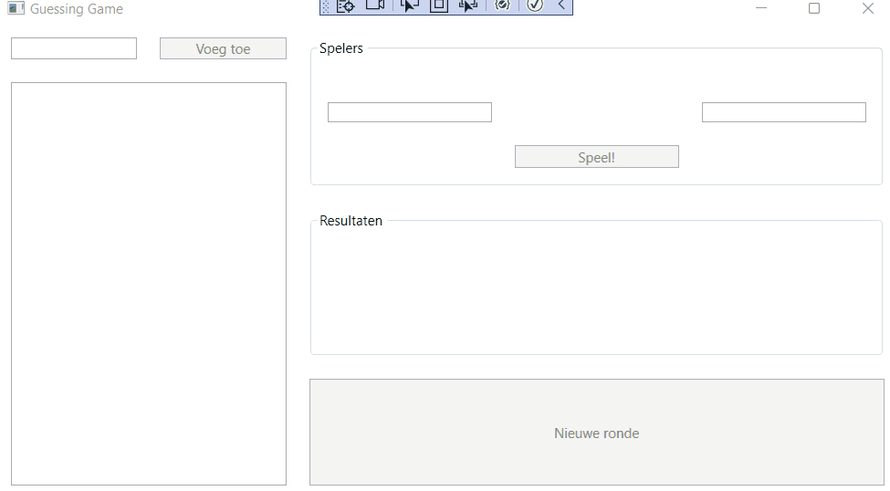

# PE2: Raadspel

For this second assignment, you program a slot game for any number of players. At startup, the application looks like this:


## Gameplay

On the left you have a panel where you have a listbox with all players. Players can be added via the `btnAddName` button. It is not activated if the text box next to it is empty.

Once there are at least two players, the `btnPlay` button becomes active and a new round can be started. A round consists of the following steps:

- Two random players are chosen from the player list, they end up in `lblFirstPlayerName` and `lblSecondPlayerName`
- Both players choose a number between 0 and 100 and enter it in `txtFirstPlayerGuess` and `txtSecondPlayerGuess`
- Then click on the `btnPlay` button

After clicking this button, it is checked whether both players have entered numbers between 0 and 100, if not, the message `Invalid input` is displayed to the users.

- The computer then chooses three random numbers and for each of those three numbers it is determined which player is closest to it. The result of this procedure ends up in `lblRseult`

- The person who was closest to it most often is the winner. If the winner in the listbox was lower than the loser, they switch places in the listbox.
- After that, a new round can be started in which two random players are chosen again.

## Example



We add the players `Dieter`, `Dries` and `Jan` to the listbox.

### First round

1. The computer randomly selects the players `Dieter` and `Jan`.
2. Dieter chooses the number `25` and Jan chooses the number `75`.
3. The computer selects the numbers `86`, `45` and `40`.
4. Dieter is closest twice (`45` and `40`), Jan 1 time (`86`).
5. Dieter wins, but since he's already at the top of the listbox, the ranking won't change.

### Second round

1. The computer randomly selects the players `Jan` and `Dries`.
2. Jan chooses the number `50` and Dries chooses the number `8`.
3. The computer selects the numbers `5`, `70` and `86`.
4. Jan is closest twice (`70` and `86`), Dries once (`5`).
5. Jan wins, and since he is lower than `Dries` in the ranking, `Jan` and `Dries` switch places..

### Third round

1. The computer randomly selects the players `Dries` and `Dieter`.
2. Dries opts for the number `41` and Dieter for the number `98`.
3. The computer selects the numbers `74`, `30` and `56`.
4. Dries is closest twice (`30` and `56`), Dieter once (`74`).
5. Dries wins, and since he is below "Dieter" in the ranking, they switch places.

## Extra remarks

Players can be added at any time, they will simply end up at the end of the list.

You can pick a random player from a list of length 5 by determining a random number between `0` and `5`, and then looking at that index in the list.

Try to make sure that two different players are always chosen in a round. You can do this by continuing to pick two random players until they are different.

To determine the difference between two numbers `firstNumber` and `secondNumber` you can use the following code. It will work if `firstNumber` is greater than `secondNumber` AND if `firstNumber` is less than `secondNumber`.

```csharp
int difference = Math.Abs(firstNumber - secondNumber);
```

Try to avoid hard-coded numbers in the methods as much as possible. Create constant variables for this.

Use methods, loops and arrays/collections as much as possible.